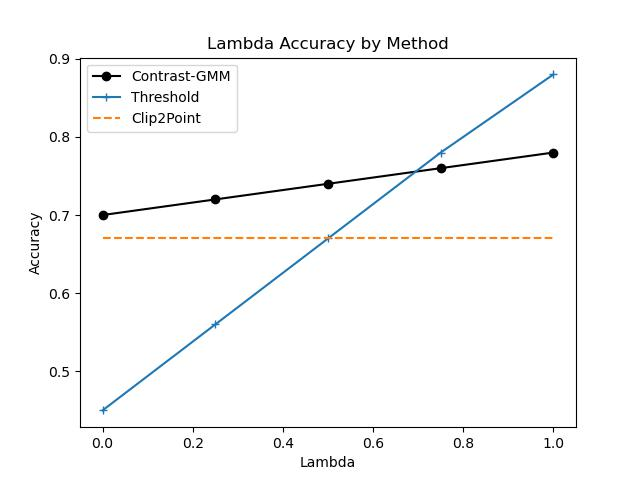

# Contrastive-GMMs for Open-World Learning
**Summary**: leverage Gaussian mixture models to clarify semi-supervised contrastive embeddings in open-set conditions.We present a light-weight, deep contrastive network which utilizes a Gaussian mixture model to identify class instances unseen at train time. Our model compares favorably with the state-of-the-art on _ModelNet40_, and we perform an ablation study to determine the impact of our newly-introduced Gaussian loss term on both the learned embeddings and model performance. Last, we discuss the potential left un-analyzed in our empirical work here, and provide direction for future work


## How to Run
A sample of _ModelNet40_ is included--unzipped--in the ``data`` folder. To run the model on the following classes (which includes ```airplane, bed, car, guitar, and toilet```). Run the ```MV-ModelNet.py``` file to reproduce our results reported in our paper. 

## Results
| δ    | λ = 0 | λ = 0.25 | λ = 0.50 | λ = 0.75 | λ = 1 |
| -----| ----- | -------- | -------- | -------- | ----- |
| 0    | 1     | 0.85     | 0.71     | 0.58     | 0.43  |
| 0.25 | 0.7   | 0.72     | 0.74     | 0.76     | 0.78  |
| 0.5  | 0.7   | 0.7      | 0.71     | 0.71     | 0.72  |


